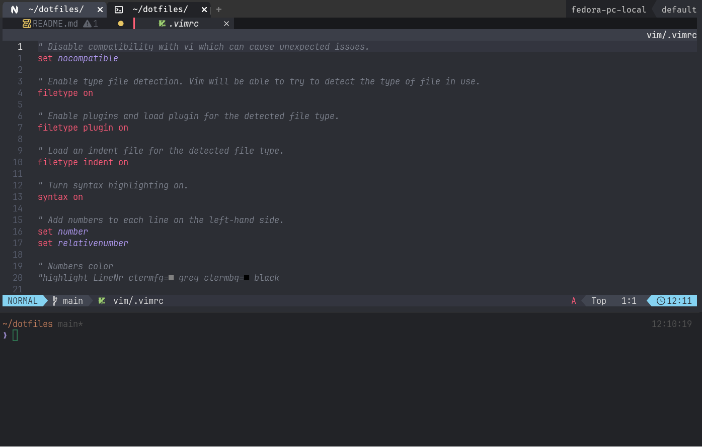

# My Fedora linux configuration

## Wezterm key bind

> [!NOTE]<br>
> How to install wezterm can be found here [Wezterm install](https://wezfurlong.org/wezterm/installation.html)

&nbsp;
Install Wezterm configuration

```bash
git clone https://github.com/RomanAverin/dotfiles
stow -v -R -t ~ wezterm
```

&nbsp;
**Leader** key is the **ctrl + space** key

| conbination | command                                                    |
| ----------- | ---------------------------------------------------------- |
| Leader + c  | copy section to clipboard                                  |
| Leader + v  | paste section from clipboard                               |
| Leader + t  | new tab                                                    |
| Leader + w  | close current tab\pane                                     |
| Leader + n  | new window                                                 |
| Leader + -  | split window horizontal                                    |
| Leader + \  | split window vertical                                      |
| Leader + l  | luncher                                                    |
| Leader + s  | new workspace with random name                             |
| Leader + f  | fuzzy find workspace                                       |
| Leader + e  | rename workspace                                           |
| Leader + r  | resize mode for the pane (hjkl or arrow key to resize)     |
| Leader + a  | move mode for the pane (hjkl or arrow key to move between) |
| Leader + i  | itentity pane/tab                                          |

<p align="center">
<b>Wezterm</b> screenshot

</p>
&nbsp;

## Drivers

- Logitech drivers and config

```bash
sudo dnf install logiops
sudo cp config/logid.cfg /etc/
sudo chown root:root /etc/logid.cfg
sudo systemctl enable logid.service
sudo systemctl start logid.service
```

## Environment

- **Install zsh and configure prompt(use zinit and powerlevel10k)**

```bash
sudo dnf install git zsh vim fzf stow zoxide
git clone https://github.com/RomanAverin/dotfiles
stow -v -R -t ~ zsh
stow -v -R -t ~ p10k.zsh
source ~/.zshrc
```

To customize the prompt

```bash
p10k configure
```

- **Install neovim**

```bash
  sudo dnf install neovim
  git clone https://github.com/RomanAverin/neovim-dotfiles ~/.config/nvim
```

- **Fix markdown-preview.nvim**

```bash
cd ~/.local/share/nvim/lazy/markdown-preview.nvim
npm install
```

- **Install some utils**

```bash
sudo dnf install htop fd-find
cargo install tlrc
```

## Dotfiles Manager

Use the `dotfiles-manager.py` Python script to simplify dotfiles management.

**Requirements**: Python 3.6+ (pre-installed on Fedora/Ubuntu)
**Dependencies**: None! Works immediately after `git clone`

### Quick Start

```bash
# Clone repository
git clone https://github.com/RomanAverin/dotfiles
cd dotfiles

# Install configs for zsh and kitty
./dotfiles-manager.py install zsh p10k.zsh kitty

# Check status of all packages
./dotfiles-manager.py status

# Move existing configs to dotfiles (with git integration)
./dotfiles-manager.py adopt ghostty

# Remove symlinks
./dotfiles-manager.py uninstall kitty

# Install all packages
./dotfiles-manager.py install --all
```

### Available Commands

- `install` - Install symlinks for packages
- `uninstall` - Remove symlinks
- `restow` - Reinstall symlinks
- `adopt` - Move existing configs to dotfiles (with git diff)
- `status` - Show status of all packages
- `list` - List available packages
- `check` - Check symlink integrity

### Options

- `-a, --all` - Apply to all packages
- `-n, --dry-run` - Simulate without changes
- `-v, --verbose` - Verbose output
- `--no-git` - Disable git integration for adopt

### Safety

The script always:
- Shows preview of changes before execution
- Requests confirmation for each operation
- Automatically creates backup files on conflicts in `.backups/`
- Logs all actions to `.logs/`
- Uses dry-run before actual changes

### Git Integration

When using `adopt` the script automatically:
1. Shows `git diff` with changes
2. Prompts to create a commit
3. Formats commit following Conventional Commits

## Troubleshooting

- **fzf problem**

```bash
fzf --zsh
unknown option: --zsh
```

Install latest version of the fzf

- **zsh compinit: insecure directories**

  Problem with permissions
  Fix it

```bash
compaudit | xargs chown -R "$(whoami)"
compaudit | xargs chmod go-w
```
